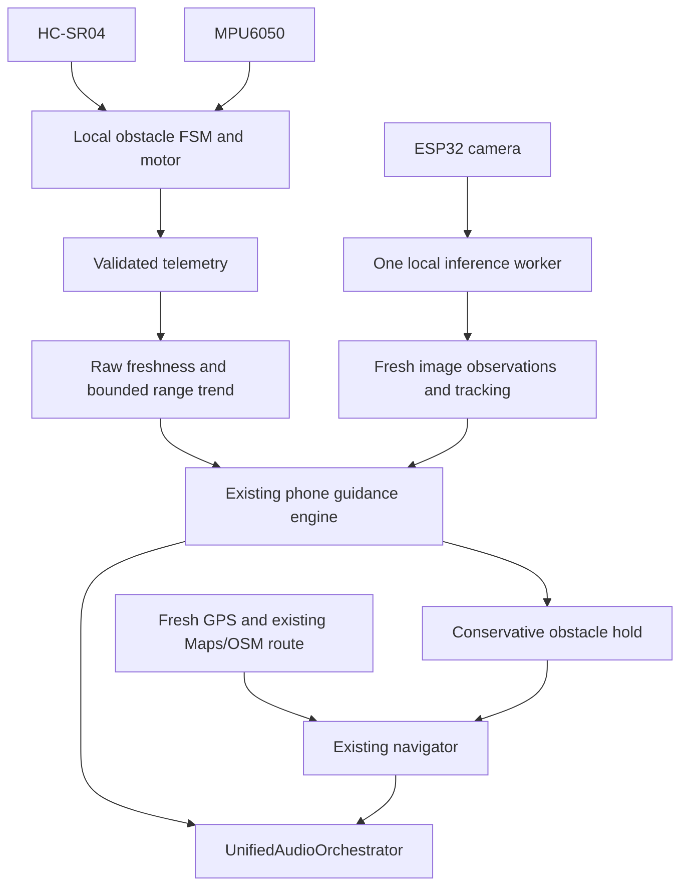

# Walking Guidance Refinement — Implemented Behavior and Limits

> GitHub publication update: matching Android/native-check sources have now been recovered from the existing repository commit `c37f442`. Read [publication notes](GITHUB_PUBLICATION_NOTES.md) and [complete setup](docs/SETUP.md) for the integrated branch. Earlier references to native source being absent describe the uploaded ZIP; APK/device validation remains unverified.

This package refines the uploaded code rather than replacing its screens, services or audio architecture. Read `BATTERY_EFFICIENCY_REFINEMENT_REPORT.md` for the full file list, measurements, validation and remaining risks.

The user confirmed one forward HC-SR04, an ESP32 camera, and a 150→140 **metres** example. Current hardware cannot measure that distant trend or exact side clearance. Camera classifications can provide qualitative awareness; they cannot establish a calibrated traversable path. No synthetic centimetre test is claimed to satisfy metre-scale ranging.

## Existing flows, now coordinated

The MCU still samples and conditions obstacles independently at its existing cadence, uses existing thresholds/hysteresis/confirmation, and owns local motor priority. It requires neither phone inference nor internet. Normal and SafeMode now produce local warnings; wake restores an unchanged warning. Explicit Sleep retains its original suspension policy and is not certified walking operation.

Phone telemetry conditions the newest raw range separately from the median-filtered UI. A sudden close reading triggers phone warning without waiting for camera inference. Approach history uses physical sample times, not HTTP request sequence; bounded rate estimates reset on error, duplicates, staleness, gaps, target discontinuity or sweeping. It projects time to the configured warning boundary, not object velocity or collision time.

Request/body/fallback delay is included conservatively in sensor age; arrival time remains a separate link diagnostic. A delayed far reading cannot release a prior obstacle hold or establish a mature range trend. Remaining advisory ETA advances with valid measurement age, is bounded at zero, expires with stale evidence and never extrapolates a new measured distance. Wall-clock rollback invalidates old sensor confidence and route permission until fresh evidence is established.

During navigation, a walking session or detected walking/sweeping, camera inference runs before an object enters the sonar proximity trigger. The existing 250 ms steady minimum interval and single pending frame/worker iteration remain. Stationary idle still avoids unnecessary captures. Hidden-screen status does not disable required vision in source; native Android continuity needs device validation.

Fresh confirmed visual objects occupy every overlapping left/center/right image band. Undetected bands remain unknown. A front ultrasonic return retains an unidentified forward source; no visual object inherits its range. Lost, stale, tentative or repeated observations cannot assert clearance. Sweeping/stale pose suppresses directional hints while preserving warnings. Image sides do not establish body-relative yaw or world coordinates.

A forward warning or central visual caution creates a stopped hold. The navigator immediately removes its old turn, cancels obsolete owned speech/taps, and preserves the destination. Missing echo or missing scene cannot clear an earlier obstruction. After fresh resolved evidence, the next fresh GPS update restores relevant map guidance. Genuine GPS off-route rerouting remains available; one local obstacle does not fabricate a new Maps route or metric sidestep.

## Scenario outcomes checked in software

| Scenario | Result |
|---|---|
| UI median remains 250 cm; new raw reading 20 cm | Immediate danger and route hold, without an inference result. |
| Warning followed immediately by danger | Escalation bypasses the prior warning cooldown. |
| Three consistent short-range closing samples | Conservative look-ahead; no exact collision prediction. |
| Left obstacle visible, front blocked | Right may be an inspection candidate while stopped; no permission to move. |
| Broad box covers all image bands | All covered bands are occupied; no side candidate. |
| Sweeping, rapid motion or stale capture/current IMU | Directional hint withheld; warning and hold retained. |
| No echo/lost center object after a warning | Existing hold remains until fresh resolving evidence. |
| Turn queued behind Live/safety audio, then hazard/stop | Guarded retry/queue/current speech is cancelled through the existing audio owner. |
| Approach reverses while speech waits at the same severity | Obsolete “range is decreasing” advice becomes invalid without adding a new audio system. |
| MCU danger remains latched after raw distance grows or echo disappears | Stop warning remains; the app does not present unconfirmed “very close” distance as a current measurement. |
| Delayed response arrives alongside a fresh camera frame | Old range/IMU stay aged; the camera frame cannot make them fresh or release a hold. |
| Stale GPS, endpoint projection far from destination | Directions paused; no false arrival. |
| Stop/restart while camera/worker/route request pending | Obsolete generation cannot revive work or publish a stopped route. |

Software results: 673 app tests, 109 firmware host checks and 15 rules tests pass. App production/demo, typecheck and Functions builds pass. All 244 app cases added over the original 429 are regression/fixture checks, not physical trials.

The existing debug overlay adds only estimated range trend/rate/time, evidence and local hold/plan diagnostics. Source FPS and request-start frame-age metrics are not measured exposure-to-motor latency. Battery life, outdoor detection reliability, mounting/yaw, sensor blind spots, walking response timing, native Android background/audio behavior and actual firmware driver compilation/testing remain unverified.
